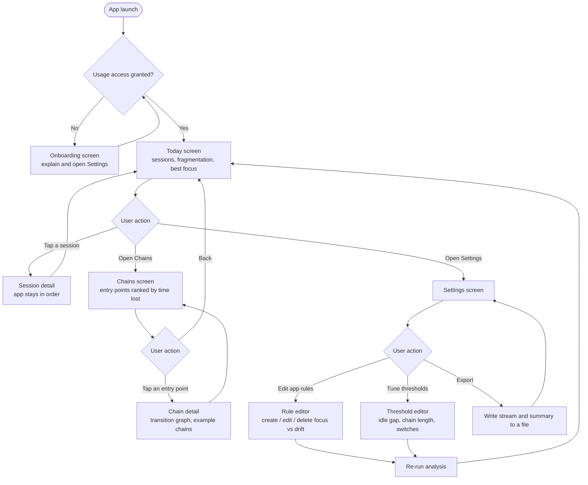

# Nazar — Attention Forensics

Nazar reads the phone's own usage-event stream and reconstructs where your attention actually went:
which sessions were broken up, which app opened the chain that ate the evening, and where the real
stretches of focus were. Everything is computed on the device and nothing leaves it.

## Project idea

Everyone knows they lose hours to their phone, and nobody knows *how*. The built-in screen-time
tools answer the wrong question — they show a bar chart of totals, which tells you that you spent
three hours in Instagram but not that a single notification at 22:10 started a forty-minute chain
that ended somewhere you never meant to go. That gap hurts people in a measurable way: fragmented
attention wrecks studying and deep work, and the evenings it eats are the ones people say they have
no time for. Nazar solves it by treating the raw system usage-event stream as a signal to be
analysed: it segments the stream into attention sessions, builds the app-to-app transition graph,
identifies the sessions that qualify as drift chains, and ranks apps by the time lost to the chains
they *start* rather than the time spent in them. It is for students and knowledge workers who
already tried screen-time dashboards, found them useless, and want to know the actual entry point so
they can close it.

## Functionality list

1. User can grant usage access through a dedicated onboarding screen, and the app reflects the
   current permission state.
2. App reads the system usage-event stream and reconstructs it into attention sessions, splitting on
   screen-off and on idle gaps.
3. App shows today's sessions with duration, app-switch count and a fragmentation score.
4. App identifies drift chains — sessions long enough and fragmented enough to count as lost time.
5. App ranks entry-point apps by the total time lost to the chains they started, worst first.
6. App shows the app-to-app transition graph with the most travelled edges.
7. App reports the longest single unbroken stay as the day's best stretch of focus.
8. User can create, edit and delete rules that classify apps as focus or drift, and the
   classification is applied to subsequent analysis.
9. User can tune the analysis thresholds (idle gap, minimum chain length, minimum switches) and see
   the results change.
10. App persists rules, thresholds and daily summaries locally, and the user can export a day's
    event stream and summary to a file.

## Flow chart



## Current folder structure

```
And-dev/
├── app/
│   ├── build.gradle.kts                      # module build script, deps, SDK levels
│   ├── proguard-rules.pro
│   ├── .gitignore
│   └── src/
│       ├── main/
│       │   ├── AndroidManifest.xml           # usage-access permission, launcher activity
│       │   ├── java/kz/nazar/attention/
│       │   │   ├── MainActivity.kt           # single activity, hosts the Compose tree
│       │   │   ├── analysis/
│       │   │   │   ├── Model.kt              # events, app stays, sessions, chains, graph edges
│       │   │   │   └── AttentionAnalyzer.kt  # the analysis core, pure Kotlin
│       │   │   ├── navigation/
│       │   │   │   └── Destinations.kt       # top-level destinations
│       │   │   └── ui/
│       │   │       ├── NazarApp.kt           # Scaffold + bottom navigation + NavHost
│       │   │       ├── screens/
│       │   │       │   └── Placeholders.kt   # Today / Chains / Settings screens
│       │   │       └── theme/
│       │   │           ├── Color.kt
│       │   │           ├── Theme.kt
│       │   │           └── Type.kt
│       │   └── res/
│       │       ├── drawable/ic_launcher_foreground.xml
│       │       ├── mipmap-anydpi-v26/        # adaptive launcher icon
│       │       ├── values/                   # strings, theme, icon background
│       │       └── xml/                      # backup and data-extraction rules
│       ├── test/java/kz/nazar/attention/
│       │   ├── AttentionAnalyzerTest.kt      # 16 JVM tests over the analysis core
│       │   └── ExampleUnitTest.kt
│       └── androidTest/java/kz/nazar/attention/
│           └── ExampleInstrumentedTest.kt    # on-device test
├── gradle/
│   ├── libs.versions.toml                    # version catalog
│   └── wrapper/                              # Gradle wrapper jar + properties
├── build.gradle.kts                          # root build script
├── settings.gradle.kts                       # module list, repositories
├── gradle.properties
├── gradlew / gradlew.bat                     # Gradle wrapper scripts
├── .gitignore
└── README.md
```

`/build`, `/app/build`, `.gradle` and `local.properties` are generated locally and are excluded by
`.gitignore`.

## Tech stack

| Concern | Choice |
| --- | --- |
| Language | Kotlin 2.2.21 |
| UI | Jetpack Compose (Material 3), Compose BOM 2025.12.01 |
| Navigation | Navigation Compose |
| Build | Gradle 8.14.3, Android Gradle Plugin 8.13.2 |
| SDK | compileSdk / targetSdk 36, minSdk 26 |
| JDK | 21 (the JBR bundled with Android Studio) |

The one platform API the app is built around is `UsageStatsManager.queryEvents`, guarded by the
`PACKAGE_USAGE_STATS` special-access permission. It is granted once from
**Settings → Special app access → Usage access**, which is why the app needs its own onboarding
screen for it rather than a runtime permission dialog.

## Build and run

### Android Studio

1. **File → Open**, then select this project folder.
2. Let Gradle sync finish. `local.properties` with the SDK path is generated on first open.
3. Press **Run**. On first launch, grant usage access when the onboarding screen offers it.

### Command line

```bash
./gradlew assembleDebug        # build the debug APK
./gradlew installDebug         # install on a connected device or emulator
./gradlew test                 # run the JVM unit tests
```

The APK lands in `app/build/outputs/apk/debug/app-debug.apk`.

## How the analysis is tested

The interesting part of this app is the analysis, and it is deliberately a set of pure functions
over a `List<UsageEvent>` with no Android types in sight. That makes it testable without a device
and without waiting for a day of real usage to accumulate:

- **JVM unit tests.** `AttentionAnalyzerTest` builds synthetic event streams — a single stay, apps
  used back to back, a long idle gap, a screen-off in the middle, a long unbroken session, a short
  fragmented one, a genuine drift chain — and asserts the segmentation, chain detection, entry-point
  ranking and transition graph against them. `./gradlew test` runs them in seconds.
- **Real data, immediately.** Once usage access is granted the app analyses the last several days of
  the phone's own history, so the very first launch shows real results instead of an empty state
  waiting to fill up.
- **Exported streams as fixtures.** A day exported from a real device can be dropped straight into
  the test sources as one more fixture, which is how thresholds get tuned against reality.

## Roadmap

SIS1 covers the scaffold and the analysis core: navigation across the three top-level screens, the
theme, the build setup, and `AttentionAnalyzer` with its unit tests. Next, in order: the
`UsageStatsManager` reader and the usage-access onboarding, the Today screen wired to real data, the
local database for rules and daily summaries, the Chains screen with the transition graph, then the
rule editor, threshold tuning and export.
